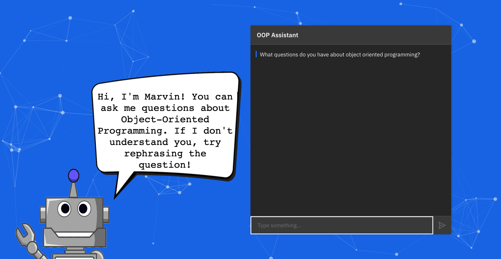

# OOP-Chatbot
Chatbot for answering Object-Oriented Programming questions for people learning OOP. Created using IBM Watson Assistant. Team Project.

Please try out our [Live Demo](http://student.uncw.edu/hcm8434/chatbot.html)
